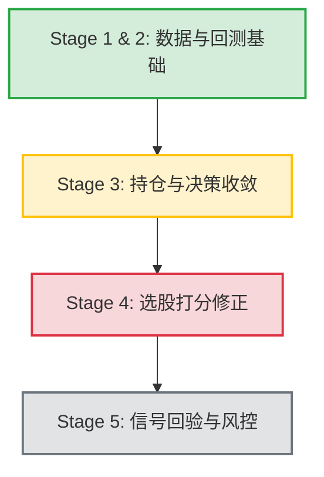

# Qlib 量化分析平台 — 全面审计与下一步实施方案报告

**审计视角：** 量化对冲基金研究总监（10+ 年 A 股量化经验）与高级量化系统架构师  
**审计日期：** 2026-07-05  
**审计对象：** Qlib Quant Platform ([d:/qlib](file:///d:/qlib))  
**项目定位：** 面向 A 股个人波段交易者（资金量 10~50 万，佣金万 2.5 + 最低 5 元，无两融，持仓周期几天至几周，行为回撤承受度约 20%）的实盘辅助决策与量化研究系统。

---

## 0. 审计总评

通过对主分支 `main`（已完成 **Stage 1 数据管道修复**）和当前开发分支 `codex/backtest-net-return`（已完成 **Stage 2 回测净收益与摩擦修正**）的源码与文档审计，本系统在架构设计上已经具备了良好的工程骨架。

**核心结论：** 
1. **基础设施已达“可用”标准**：前期通过 Baostock 原始价格与累积后复权因子的单源重构（Stage 1），彻底解决了历史数据拼接跳变和空心 bin 导致的技术信号失效问题；
2. **回测环境已达“可信”标准**：在当前分支中，完成了扣费净收益（`r_net = report.return - report.cost`）替代毛收益、万 8 卖出费率默认值、资金参数化（30万）以及 Volume & Slippage 约束的修复，隐藏 of 5%~18.5%/年的高额交易摩擦已被显性化；
3. **“研究玩具”向“实战工具”跨越的临界点**：系统目前仍然存在**选股打分等权降级**、**持仓记录真空**、**复盘决策过载（每日240+条信号）**、**海龟计划未按 100 股整手取整**以及**选股历史无回验监控**等关键漏洞。
4. **不修改文件原则**：本次审计遵循要求，未对工作区任何源文件进行修改，仅针对现有代码进行取证分析并规划后续方案。

---

## 1. 已完成工作审计成果（Stage 1 & 2）

### ✅ Stage 1: 数据管道修复与重建（已合并至 `main`）
- **修复问题**：针对此前“前复权增量只追加不重写”造成的复权基准断裂（98.2% 的股票存在 >11% 假涨跌）和 61 只核心股票“空心 bin”的问题进行了重构。
- **实现方案**：
  - `update_cn_data.py` 改用 Baostock 原始价（`adjustflag="3"`）与后复权累积因子（`backAdjustFactor`），由 Qlib 体系统一进行复权价折算；
  - `extend_calendar` 增加硬校验，防止日历中段插入导致索引错位；
  - 完善 `/api/data/health` 健康检查，包含有效值密度与连续 NaN 检测，彻底摘除了“数据空心但显示新鲜”的假象。

### ✅ Stage 2: 回测净收益与真实摩擦修正（当前分支 `codex/backtest-net-return`）
- **修复问题**：针对此前回测报表使用 0 摩擦“毛收益”、策略每日单边换手 20%（`n_drop = topk // 5`）、资金量硬编码 100 万等掩盖真实摩擦的问题进行了修正。
- **实现方案**：
  - [backend/api/backtest.py:483-487](file:///d:/qlib/backend/api/backtest.py#L483-L487) 改用 `r_net = r - cost` 计算所有收益、夏普、Calmar 等统计指标，并在前端同屏输出毛收益和净收益两条曲线；
  - 交易成本参数化：[backend/models/schemas.py:162-163](file:///d:/qlib/backend/models/schemas.py#L162-L163) 将 `sell_cost` 默认值修正为符合 A 股的 `0.0008`，`account` 默认资金量下调至 30 万；
  - 恢复启用 `volume_threshold`（日成交量 5% 限制）与 `impact_cost`（0.1% 冲击成本），并处理了 Windows 平台下并行执行 of hang 风险；
  - 修正了指数 bin 缺失问题，恢复了 `SH000300` benchmark 对照。

---

## 2. 遗留核心漏洞与功能断裂带审计（P&L 关键链）

### 🔴 #1 智能股票池“ICIR 加权”从未生效（降级为噪声选股）
- **漏洞位置**：[backend/core/stock_pool.py:271](file:///d:/qlib/backend/core/stock_pool.py#L271)
- **源码取证**：
  ```python
  cache_path = Path.home() / ".qlib" / "cache" / "factor_icir.parquet"
  ```
  全仓 grep 仅此一处引用，**没有任何写入该 parquet 的逻辑**。因此 `icir_map` 恒为空。
- **后果**：每次股票池打分都会静默进入 `stock_pool.py:240-246` 的降级分支，对 158 个**未经过截面标准化、未按预期 IC 方向调向**的因子值进行简单算术平均。动量和反转因子互相抵消，最终得分基本为随机噪声，用户实际拿到的是“噪声选股清单”。

### 🔴 #2 系统对持仓管理完全真空，复盘决策条目严重过载
- **漏洞位置**：后端 `backend` 目录下无任何存储持仓、委托、交易历史的表或文件。
- **后果**：
  1. 系统无法回答“我手里的持仓，明天开盘该怎么处理（加仓/减仓/止损）”；
  2. 决策条目极度稀释：每晚默认产生包含 30 只股票池、20 个热门板块、20+ 只 ETF、**181 组配对交易全量返回**等在内的 240+ 个决策条目。对于精力有限的个人交易者，极易造成选择焦虑、漏单和追高，缺少收敛至“今晚只看 3 只票”的过滤机制。

### 🔴 #3 海龟交易计划“不可执行”，不包含摩擦费用且超额资金不拦截
- **漏洞位置**：[backend/core/turtle_trade.py:81-82](file:///d:/qlib/backend/core/turtle_trade.py#L81-L82)
- **源码取证**：
  ```python
  raw_unit_shares = math.floor(risk_budget / stop_distance)
  unit_shares = max(1, raw_unit_shares)
  ```
- **后果**：
  1. `unit_shares` 未进行 A 股买入最低 100 股（整手）取整。高价股极易算出来如 83 股，导致券商终端无法下单。
  2. 盈亏比分子（[turtle_trade.py:96](file:///d:/qlib/backend/core/turtle_trade.py#L96)）为纯价格差，未扣减买卖往返佣金、印花税及最低 5 元佣金门槛，高价股或大波动下可能被高估。
  3. 当加仓满额后名义市值超过账户总资金时（[turtle_trade.py:105-108](file:///d:/qlib/backend/core/turtle_trade.py#L105-L108)），仅记录 warning，依然输出 `verdict="可执行"`，容易诱导穿仓。

### 🟡 #4 信号推荐“只荐不检”，策略失效无法被熔断
- **漏洞位置**：`backend/api/screening.py` 每次请求均通过后台任务现算，没有历史推荐记录表。
- **后果**：由于不落库，系统无法计算推荐信号的历史胜率（T+5/T+10）。一旦市场风格大面积切向（如成长切红利），多因子策略在样本外持续回撤，系统因没有监测机制，无法及时给用户发出“策略已失效，暂停开新仓”的动态风控提示。

### 🟡 #5 配对交易 beta 引入未来函数，p-value 用相关系数硬编码
- **漏洞位置**：[backend/api/pair.py:310](file:///d:/qlib/backend/api/pair.py#L310) (使用整段历史计算对冲比率 $\beta$ 导致历史开仓信号失真)；[pair.py:247](file:///d:/qlib/backend/api/pair.py#L247) 硬编码 p 值：
  ```python
  p_value = 0.05 if abs(correlation) > 0.8 else (0.01 if abs(correlation) > 0.9 else 0.1)
  ```
- **后果**：`abs(correlation) > 0.9` 包含在 `> 0.8` 内，导致 p-value 恒为 0.05，属于死代码。协整检验不存在，信号可信度较低。

---

## 3. 下一步实施计划 (90天行动指南)

针对以上漏洞，在接下来的开发中建议分三个阶段（Stage 3, 4, 5）逐步补齐：



### 📅 Stage 3: 持仓管理与决策收敛 (建议 3~4 周)
**目标**：解决“不知道持仓什么”和“今晚看不过来”的执行痛点。
1. **新建持仓表**：
   - 增加 SQLite 本地数据库 `~/.qlib/positions.db`，保存字段：`code` (代码), `shares` (股数), `cost_price` (成本价), `stop_loss_price` (止损价), `buy_date` (买入日)。
   - 提供 `GET/POST/DELETE /api/positions` 接口。
2. **构建“聚焦与持有复核”工作流**：
   - 新增 `GET /api/dashboard/focus` 接口。
   - 对持仓股票：读取当日收盘价，对照止损价，输出 `verdict`（持有 / 止损触发 / 接近加仓）。
   - 对选股信号（`buyable`）：按综合评分排序，**仅截取前 3 只**，并给出简短的选股逻辑描述。
3. **配对与 ETF 截断**：
   - 配对列表接口 `GET /api/pair/list` 增加 `limit=10` 默认参数，仅按相关性降序返回前 10 组。
4. **海龟计划可执行性修正**：
   - `unit_shares` 计算中加入 `// 100 * 100` 向下取整。若算得股数不足 100，`verdict` 改为 `不建议执行` 并提示“资金量不足以买入一手”；
   - 盈亏比公式中，将买卖佣金、印花税及最低 5 元限制进行估算扣减；
   - 当 `max_position_value > account_equity` 时，强制令 `verdict = "不建议执行"`。

### 📅 Stage 4: 股票池打分与因子权重修复 (建议 2 周)
**目标**：使股票池打分逻辑符合“多因子选股”的科学原则。
1. **因子分析结果落盘**：
   - 在 `backend/api/factors.py` 因子分析异步任务（计算 ICIR）结束时，将结果以 `DataFrame` 格式写入到 `~/.qlib/cache/factor_icir.parquet`。
2. **等权降级分支合理化**：
   - 在 `stock_pool.py` 中，如果读取该 parquet 缓存失败，则在响应 headers / warnings 中透出警告：“ICIR 缓存缺失，已降级为标准化等权”；
   - 降级逻辑修改：**先对各因子值进行截面 Z-score 标准化，并乘以因子预期方向（符号转换）**，然后再进行等权相加，防止信号对消。
3. **顶层计算截断优化**：
   - [backend/api/factors.py:184](file:///d:/qlib/backend/api/factors.py#L184) 中的 `[:params.top_k]` 截断应仅用于前端渲染，后台因子相关性和 IC 计算时应当使用全量 158 个因子，避免局部优化陷阱。

### 📅 Stage 5: 推荐历史回验与动态风控 (建议 2~3 周)
**目标**：形成“推荐-交易-回验-自适应风控”的生命周期闭环。
1. **选股历史记录表**：
   - 新建 `~/.qlib/screening_history.db`，在盘后选股任务执行时，记录当天推荐的前 5 只买入股票。
2. **滚动绩效评估**：
   - 新增 `GET /api/screening/report` 端点，提取过去 20 个交易日的推荐历史，调用 Qlib 提取未来 5 个交易日的实际累计收益，生成“信号胜率图表”；
   - 当最近 3 期推荐的 5 日胜率均低于 40% 时，在筛选详情中强力提示：“当前市场风格偏离，策略胜率极低，建议暂停开仓，进入空仓观察期”。
3. **自适应仓位控制**：
   - 结合用户 20% 的行为回撤偏好，如果策略历史回撤放大，建议仓位上限应自动进行比例缩减（如：`建议仓位 = min(1.0, 0.20 / abs(当前滚动最大回撤))`）。

---

## 4. 架构师观点：如何理解本系统的设计边界？

作为个人量化平台，开发者应当明晰以下**不建议碰的边界**，以防止工程失控：
1. **不要自研回测框架**：Qlib 内部的交易模拟器和 `TopkDropoutStrategy` 已经支持订单簿限制、成交量上限和真实手续费，所有回测口径通过改写 `exchange_kwargs` 传递即可。自研回测框架是时间黑洞。
2. **不要堆叠行情流与分布式**：本平台定位为“盘后复盘系统”，SQLite + 内存缓存的单容器架构对于百只以内的标的数据是完美的。不要在此阶段引入 Kafka, Redis 哨兵或 K8s 部署。
3. **停滞无意义的 LLM 探索**：目前的“智能体辩论”和“AI 策略点评”已能基于真实的 K线摘要运作。在完成持仓、打分和信号回验之前，不应再向非 PL 关键的自然语言理解模块注入研发时间。

---
*本报告由 Antigravity 审计专家生成，旨在为用户提供清晰的项目现状和执行路径指南。*
